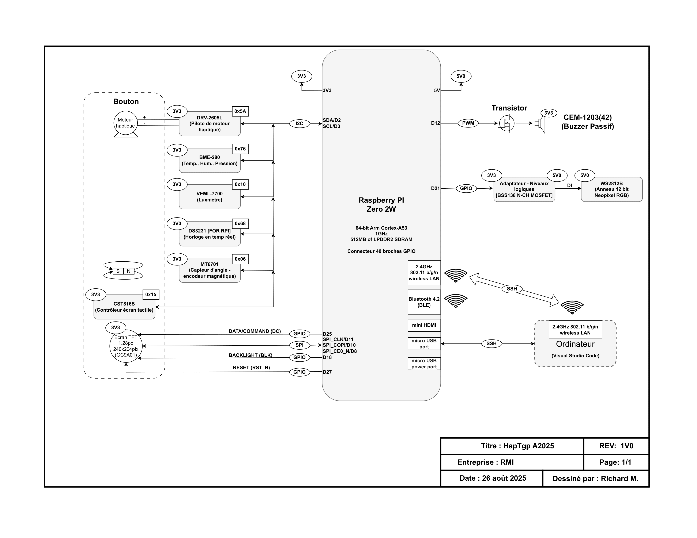

# ✨ HapTgp A2025  
**Prototype haptique et capteurs avec Raspberry Pi Zero 2 W**

---

## 🛰️ Schéma fonctionnel
<p align="center">
  
</p>


---

## 🛰️ Aperçu  
**HapTgp A2025** est une plateforme interactive combinant **retour haptique** et **capteurs environnementaux**, construite autour d’un **Raspberry Pi Zero 2 W**.  
Le système intègre plusieurs capteurs, un encodeur magnétique et un moteur haptique pour créer une expérience tactile et visuelle réactive.

Ce prototype a été conçu dans le cadre du projet **RMI**, le **26 août 2025**.  

---

## 🧩 Prototype sur breadboard
<p align="center">
  
</p>

---

## ⚙️ Programmation et architecture logicielle
<p align="center">
  
</p>

---

## 🧪 Photo du prototype réel
<p align="center">
  
</p>

---
## ⚙️ Architecture matérielle  

| Composant | Fonction | Communication | Adresse / Broche |
|------------|-----------|----------------|----------------|
| **DRV2605L** | Pilote de moteur haptique | I²C | `0x5A` |
| **BME280** | Capteur de température / humidité / pression | I²C | `0x76` |
| **VEML7700** | Luxmètre (capteur de lumière ambiante) | I²C | `0x10` |
| **DS3231 FOR RPi** | Horloge temps réel (RTC) | I²C | `0x68` |
| **MT6701** | Encodeur magnétique d’angle | I²C | `0x06` |
| **CST816S** | Contrôleur d’écran tactile | I²C | `0x15` |
| **Écran TFT 1.28″ GC9A01** | Afficheur SPI | SPI | D25 (CLK), D24 (CS), D23 (MOSI) |
| **CEM-1203(42)** | Buzzer passif | PWM D12 (avec transistor) | – |
| **Anneau WS2812B RGB** | Indicateur lumineux 12 bits | GPIO D21 | 5 V |
| **Raspberry Pi Zero 2 W** | Processeur principal – 64-bit Arm Cortex-A53 @ 1 GHz, 512 MB LPDDR2 | – | – |

---

## 🔌 Schéma de communication  
- **Bus I²C** : BME280, DRV2605L, VEML7700, DS3231, MT6701, CST816S  
- **Bus SPI** : Écran TFT (GC9A01)  
- **GPIO / PWM** : Buzzer (CEM-1203) et anneau LED (WS2812B)  
- **Sans fil** :  
  - Wi-Fi 2.4 GHz (connexion SSH via Visual Studio Code)  
  - Bluetooth 4.2 (compatible BLE)

---

## 🧩 Fonctionnalités  
✅ Surveillance environnementale en temps réel  
✅ Entrée rotative magnétique avec retour haptique  
✅ Écran tactile interactif  
✅ Rétroaction lumineuse RGB (anneau WS2812B)  
✅ Sortie sonore via buzzer passif  
✅ Développement et débogage à distance via SSH et VS Code  

---

## 🧠 Pile logicielle  
| Couche | Description |
|--------|--------------|
| **Système d’exploitation** | Raspberry Pi OS (Lite ou Full) |
| **Langage** | Python 3 / CircuitPython |
| **Bibliothèques** | `adafruit_drv2605`, `adafruit_bme280`, `adafruit_veml7700`, `adafruit_ds3231`, `adafruit_rgbled`, `PIL`, `spidev` |
| **Interfaces** | I²C, SPI, GPIO (PWM) |
| **Outil de développement** | Visual Studio Code (via SSH) |

---

## 🔬 Déroulement typique  
1. Démarrer le Raspberry Pi Zero 2 W.  
2. Se connecter en SSH depuis Visual Studio Code.  
3. Exécuter le programme Python (`main.py`).  
4. Tourner l’encodeur ou appuyer sur le bouton → le moteur haptique vibre.  
5. Observer les données sur l’écran TFT et les LEDs RGB.  

---

## 💾 Exemple de code  
```python
import board, busio
import adafruit_drv2605, adafruit_bme280, adafruit_veml7700

i2c = busio.I2C(board.SCL, board.SDA)

drv = adafruit_drv2605.DRV2605(i2c)
bme = adafruit_bme280.Adafruit_BME280_I2C(i2c)
lux = adafruit_veml7700.VEML7700(i2c)

print(f"Température : {bme.temperature:.1f} °C")
print(f"Humidité : {bme.humidity:.1f} %")
print(f"Luminosité : {lux.lux:.1f} lx")

# Rétroaction haptique
drv.sequence[0] = adafruit_drv2605.Effect(47)  # Clic net
drv.play()
